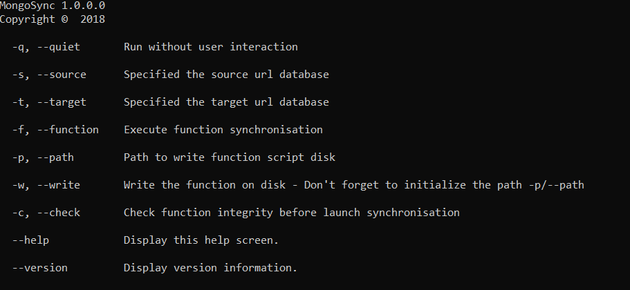

# MongoDbSynchronisation
MongoDbSynchronisation is a tool to synchronize document between 2 MongoDb (support azure).

## Prerequisites
The build in release mode can create the VSTS extension. But it's use TFX package, you must install it before if you want to generate this extension.
1. Install [Node.js](https://nodejs.org/en/)
2. Install the extension packaging tool (TFX) by running `npm install -g tfx-cli` from a command prompt

## Version 1
The version 1.0.0 support the synchrnoisation of functions from source data base to target database.

## Usage
Run the tool in command line. 
Use command line parameter to execute the tool. 
You can use --help to see the help.

    mongoSync.exe --help

### Example
    -q -f -s mongodb://localhost:27017/target -t mongodb://localhost:27017/source

This example start the tool in quiet mode (remove user interaction).
It's start the function synchronisation from target database in localhost to target database in localhost.

## Visual Studio Team Services build or release task
The tool support Visual Studio Team Services
View on the [marketplace](https://marketplace.visualstudio.com/items?itemName=Cedric-Michel.build-release-task#overview).

### Future
* index synchronisation
* execute script to manipulate document

